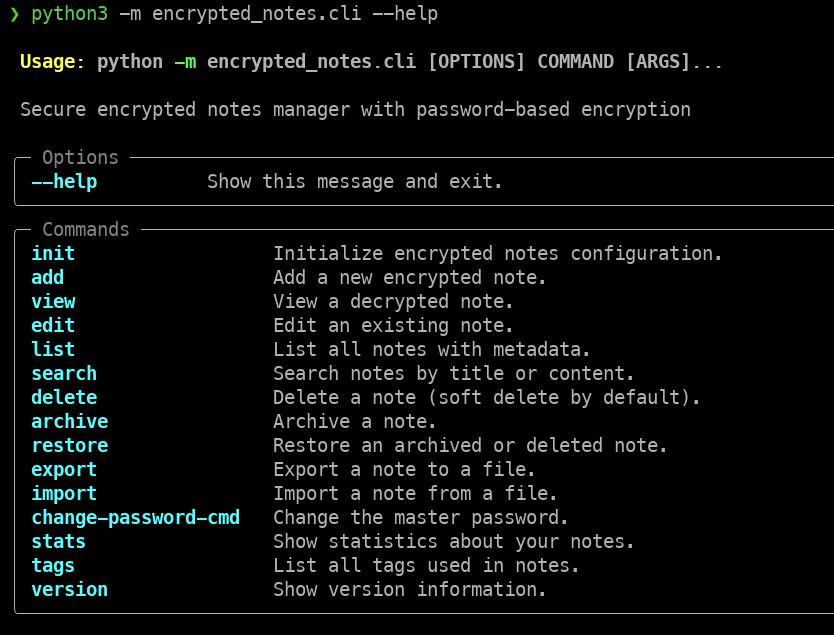
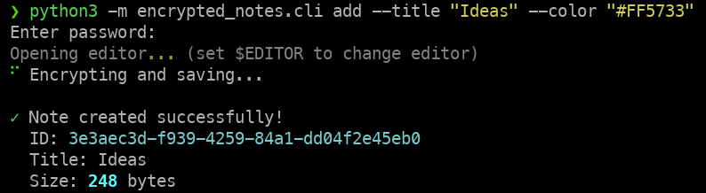
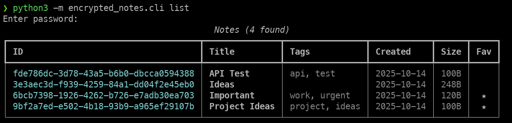
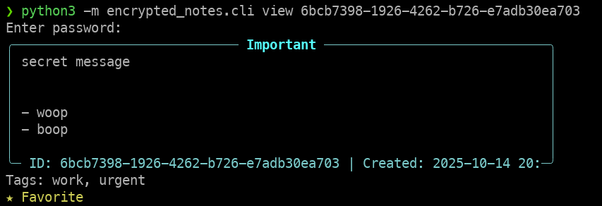

# 🔐 Encrypted Notes Manager

## 📦 Getting Started

### Prerequisites

- Python 3.10+
- poetry (highly recommended)

### Using Poetry (recommended)

```bash
git clone https://github.com/yourusername/encrypted-notes.git
cd encrypted-notes

# Install with poetry
poetry install

# Activate virtual environment
poetry shell
```

## 🚀 Quick Start



### 1. Initialize the application

This part is important for CLI and REST API usage.

```bash
cd backend
python3 -m encrypted_notes.cli init

# Custom storage location
python3 -m encrypted_notes.cli init --storage ~/my-secure-notes
```

This creates:

- Config file at `~/.config/encrypted_notes/config.json` (contains salt)
- Storage directory at `~/.config/encrypted-notes/storage/` (encrypted notes)

**Important**: Choose a strong master password! It cannot be recovered if lost.

### 2. Add a new note

```bash
# Opens your default editor ($EDITOR)
python3 -m encrypted_notes.cli.py add --title "My First Note"

# Or provide content inline
python3 -m encrypted_notes.cli.py add --title "Quick Note" --content "Secret information"

# With tags and as favorite
python3 -m encrypted_notes.cli.py add \
  --title "Project Ideas" \
  --tag project \
  --tag ideas \
  --favorite \
  --color "#FF5733"
```



### 3. View notes

```bash
# List all active notes
python3 -m encrypted_notes.cli.py list

# View a specific note by ID
python3 -m encrypted_notes.cli.py view <note-id>
```





## 🌐 REST API Usage

### Start the server

```bash
# Development mode
python3 -m encrypted_notes.api
```
